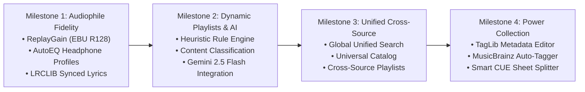
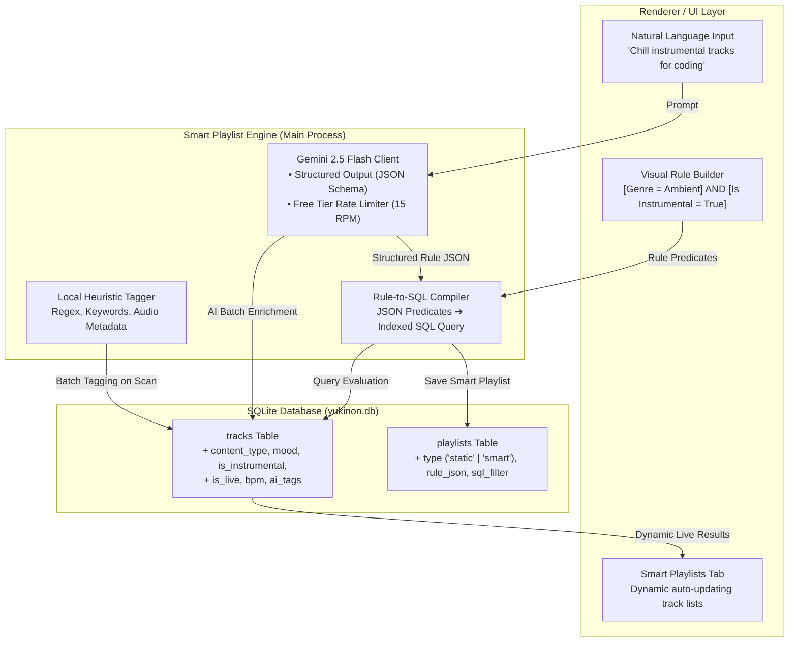

# Yukinon Architecture Roadmap & Smart Dynamic Playlists Specification

A comprehensive technical blueprint for advancing Yukinon into a premier audiophile media workstation with **Dynamic Rule-Based Playlists**, **Acoustic Content Classification** (Instrumental, Live, ASMR, Podcast), and **Gemini 2.5 Flash AI Integration**.

---

## 1. Product Evolution Roadmap (The 4 Milestones)



### Milestone 1: Audiophile Fidelity & Headphone Profiles (Next Immediate)
- **ReplayGain (EBU R128):** Parse track and album gain tags; automatically apply normalization via Web Audio `preampGain` to prevent sudden loudness spikes.
- **AutoEQ Headphone Database:** Pre-bundle the 4,000+ headphone Harman curve database. Users pick their headphone model (e.g., *Sennheiser HD 600*, *Sony WH-1000XM5*) to automatically calibrate the 10-band EQ.
- **LRCLIB Integration:** Automated fetcher for synchronized line-by-line scrolling lyrics in FullscreenPlayer.

### Milestone 2: Dynamic Playlists & Content Classification (Focus of this Spec)
- **Rule-Based Smart Playlists:** SQLite-backed dynamic queries (filters by artist, genre, year, quality, play count, content type).
- **Dual-Engine Content Classifier:**
  - *Engine A (Local Heuristic):* 100% offline regex & tag parser for Live, Instrumental, ASMR, Podcast, and Soundtrack.
  - *Engine B (Gemini 2.5 Flash AI):* Batch enrichment for mood, tone, sub-genres, and natural language playlist creation.

### Milestone 3: Unified Cross-Source Search
- A single global omnibar querying Local SQLite tracks, Jellyfin albums, Subsonic streams, and YouTube Music in categorized sections.

### Milestone 4: Power Collection Management
- Bidirectional TagLib integration for in-place tag editing, embedded artwork writing, and MusicBrainz metadata matching.

---

## 2. Dynamic Playlists: System Architecture



---

## 3. Database Schema Extensions

To support dynamic playlists and multi-dimensional music attributes, extend `yukinon.db`:

```sql
-- 1. Extend tracks table with content classification attributes
ALTER TABLE tracks ADD COLUMN content_type TEXT DEFAULT 'music'; 
-- Values: 'music', 'instrumental', 'live', 'asmr', 'podcast', 'soundtrack', 'audiobook'

ALTER TABLE tracks ADD COLUMN is_instrumental BOOLEAN DEFAULT 0;
ALTER TABLE tracks ADD COLUMN is_live BOOLEAN DEFAULT 0;
ALTER TABLE tracks ADD COLUMN mood TEXT; 
-- Values: 'chill', 'focus', 'energetic', 'melancholic', 'ambient', 'sleep'

ALTER TABLE tracks ADD COLUMN bpm REAL;
ALTER TABLE tracks ADD COLUMN key_signature TEXT;
ALTER TABLE tracks ADD COLUMN ai_tags TEXT; -- JSON array of descriptive tags: ["lofi", "acoustic", "japanese"]
ALTER TABLE tracks ADD COLUMN replaygain_track_gain REAL; -- in dB, e.g. -6.2
ALTER TABLE tracks ADD COLUMN replaygain_track_peak REAL; -- peak amplitude, e.g. 0.98

-- 2. Extend playlists table to support smart rule definitions
ALTER TABLE playlists ADD COLUMN type TEXT DEFAULT 'static'; -- 'static' | 'smart'
ALTER TABLE playlists ADD COLUMN rule_json TEXT; -- Serialized rule tree
ALTER TABLE playlists ADD COLUMN sql_filter TEXT; -- Precompiled parameterized WHERE clause
ALTER TABLE playlists ADD COLUMN icon TEXT; -- Optional custom icon, e.g. 'Sparkles', 'Radio', 'Headphones'

-- 3. Create performance indexes for real-time evaluation
CREATE INDEX IF NOT EXISTS idx_tracks_content_type ON tracks(content_type);
CREATE INDEX IF NOT EXISTS idx_tracks_mood ON tracks(mood);
CREATE INDEX IF NOT EXISTS idx_tracks_instrumental ON tracks(is_instrumental);
CREATE INDEX IF NOT EXISTS idx_tracks_live ON tracks(is_live);
CREATE INDEX IF NOT EXISTS idx_tracks_genre_year ON tracks(genre, year);
```

---

## 4. Dual-Engine Content Classification

### Engine 1: Offline Deterministic Heuristics (Zero API Cost, Fast)
Executes automatically during folder scanning (`library:scan`) in `src/main/ipc/library.ts`.

```typescript
export interface TrackClassification {
  contentType: 'music' | 'instrumental' | 'live' | 'asmr' | 'podcast' | 'soundtrack'
  isInstrumental: boolean
  isLive: boolean
  suggestedMood?: string
}

export function classifyTrackHeuristically(meta: {
  title?: string
  artist?: string
  album?: string
  genre?: string
  path: string
  duration?: number
  bitrate?: number
}): TrackClassification {
  const text = `${meta.title || ''} ${meta.album || ''} ${meta.artist || ''} ${meta.genre || ''} ${meta.path}`.toLowerCase()
  
  // 1. ASMR / Relaxation Detection
  if (/\b(asmr|whisper|binaural|tingles|ear cleaning|roleplay|tapping|sleep aid)\b/i.test(text)) {
    return { contentType: 'asmr', isInstrumental: false, isLive: false, suggestedMood: 'sleep' }
  }

  // 2. Podcast / Spoken Word Detection
  if (/\b(podcast|episode|interview|talk show|audiobook|narrat(ed|ion))\b/i.test(text) || (meta.duration && meta.duration > 1800 && (meta.bitrate || 0) < 128000)) {
    return { contentType: 'podcast', isInstrumental: false, isLive: false, suggestedMood: 'focus' }
  }

  // 3. Live Concert Performance Detection
  const isLive = /\b(live at|live in|live from|in concert|unplugged|live session|tour edition|live audio)\b/i.test(text)
  
  // 4. Instrumental Detection
  const isInstrumental = /\b(instrumental|karaoke|backing track|bgm|piano version|orchestral|minus one|score)\b/i.test(text) ||
    /^(classical|ambient|lo-fi|post-rock)$/i.test(meta.genre || '')

  // 5. Soundtrack / Game Music
  const isSoundtrack = /\b(ost|soundtrack|original soundtrack|original score|vgm|game audio)\b/i.test(text)

  const contentType = isLive ? 'live' : isInstrumental ? 'instrumental' : isSoundtrack ? 'soundtrack' : 'music'

  return { contentType, isInstrumental, isLive }
}
```

---

### Engine 2: Gemini 2.5 Flash AI Integration (Free API Tier)

#### Why Gemini 2.5 Flash?
- **Zero Cost:** Google AI Studio free tier offers 15 Requests Per Minute (RPM), 1 Million Tokens Per Minute (TPM), and 1,500 Requests Per Day.
- **Speed:** Sub-500ms latency on structured JSON generation.
- **Batching:** 50 tracks can be enriched in a single API call (~1,200 tokens). A library of 1,000 tracks requires only **20 calls**, completing in under 2 minutes within free tier limits.

#### A. Secure API Key Management
Stored in encrypted settings (`app_settings` key `gemini_api_key`) and accessed via IPC:
- Users provide their free key in **Settings > Integrations > Google Gemini API**.
- Key is never hardcoded or transmitted outside of direct Google AI endpoints (`generativelanguage.googleapis.com`).

#### B. Batch Track Enrichment API
```typescript
import { GoogleGenerativeAI, SchemaType } from '@google/generative-ai'

export async function enrichTracksWithGemini(
  apiKey: string,
  tracksBatch: Array<{ id: string; title: string; artist: string; album: string; genre: string }>
) {
  const genAI = new GoogleGenerativeAI(apiKey)
  const model = genAI.getGenerativeModel({
    model: 'gemini-2.5-flash',
    generationConfig: {
      responseMimeType: 'application/json',
      responseSchema: {
        type: SchemaType.ARRAY,
        items: {
          type: SchemaType.OBJECT,
          properties: {
            id: { type: SchemaType.STRING },
            contentType: { 
              type: SchemaType.STRING, 
              enum: ['music', 'instrumental', 'live', 'asmr', 'podcast', 'soundtrack'] 
            },
            mood: { 
              type: SchemaType.STRING, 
              enum: ['chill', 'focus', 'energetic', 'melancholic', 'ambient', 'sleep'] 
            },
            isInstrumental: { type: SchemaType.BOOLEAN },
            isLive: { type: SchemaType.BOOLEAN },
            aiTags: { 
              type: SchemaType.ARRAY, 
              items: { type: SchemaType.STRING } 
            }
          },
          required: ['id', 'contentType', 'mood', 'isInstrumental', 'isLive', 'aiTags']
        }
      }
    }
  })

  const prompt = `Analyze this music library track batch and return audio classification, mood, and genre tags:
${JSON.stringify(tracksBatch, null, 2)}`

  const result = await model.generateContent(prompt)
  return JSON.parse(result.response.text())
}
```

---

## 5. Natural Language & Dynamic Smart Playlists

Users can build dynamic playlists via two distinct interfaces:

### Interface 1: Visual Rule Builder (Deterministic Filters)
Allows combining nested predicates:
- `[Content Type] [is] [Instrumental]`
- `[Year] [greater than] [2018]`
- `[Bitrate] [greater than or equal to] [320]` (Audiophile filter)
- `[Play Count] [greater than] [10]` (Top Tracks)
- `[Is Favorite] [is] [True]`

### Interface 2: Natural Language Prompt (Powered by Gemini 2.5 Flash)
Users type natural sentences directly into a prompt bar in the Playlists tab:
> *"Create a late-night coding playlist with chill instrumental ambient tracks over 4 minutes long."*
> *"Find all high-res live concert recordings from the 1990s."*
> *"Collect all ASMR and sleep audio tracks."*

Gemini compiles the natural prompt into an executable **Smart Playlist Specification**:

```json
{
  "name": "Late-Night Coding",
  "icon": "Code",
  "description": "Chill instrumental ambient tracks (> 4m) for deep focus",
  "rules": {
    "condition": "AND",
    "rules": [
      { "field": "is_instrumental", "operator": "equals", "value": 1 },
      { "field": "duration", "operator": "greater_than", "value": 240 },
      { "field": "mood", "operator": "in", "value": ["chill", "ambient", "focus"] }
    ]
  },
  "sqlWhere": "(is_instrumental = 1 AND duration > 240 AND mood IN ('chill', 'ambient', 'focus'))",
  "orderBy": "added_at DESC",
  "limit": 50
}
```

### Real-Time Live Dynamic Updates
Because the playlist stores the **`sqlWhere` rule definition** rather than static track IDs:
1. When new music is imported or downloaded into Yukinon, it runs through the classifier.
2. The Smart Playlist immediately includes the newly imported tracks upon the next click—no manual playlist maintenance required!

---

## 6. Implementation Architecture & File Layout

```
src/
├── main/
│   ├── db.ts                          <- Extended tracks and playlists tables with WAL indexes
│   ├── ipc/
│   │   ├── library.ts                 <- Integrated heuristic classifier on file scanner
│   │   ├── playlists.ts               <- Smart playlist evaluator & dynamic SQL executor
│   │   └── ai.ts                      <- Gemini 2.5 Flash client, rate limiter, batch enrichment
├── renderer/src/
│   ├── components/
│   │   ├── Playlists/
│   │   │   ├── PlaylistsView.tsx      <- Displays static and smart playlists with badges
│   │   │   ├── CreateSmartPlaylistModal.tsx <- Visual rule builder & natural language prompt
│   │   │   └── SmartPlaylistBadge.tsx <- Visual indicator with live track count
│   │   └── Settings/
│   │       └── SettingsView.tsx       <- "AI & Smart Library" settings tab (Gemini API key, batch scan)
└── shared/
    └── types.ts                       <- SmartPlaylist, PlaylistRule, TrackClassification interfaces
```
